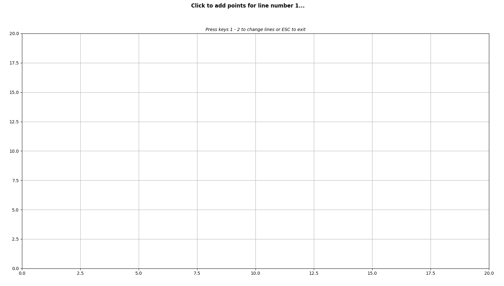
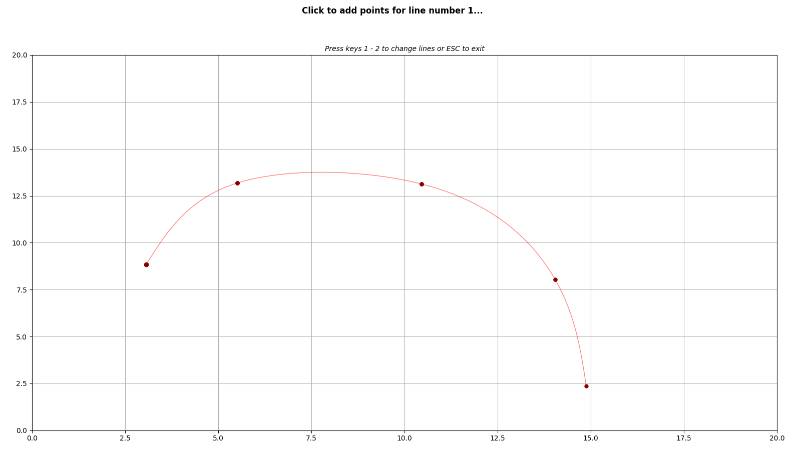
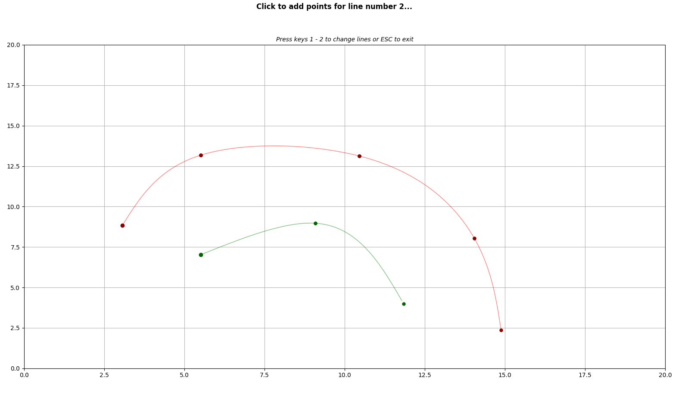

Coordinate Canvas
=================

Interactive canvas that allows you to draw 2D coordinates in
a plane and output their corresponding coordinates to a JSON file.

Installation
------------

Instructions below assume that your Python interpreter is
linked to the ```python``` alias.::

    python -m pip install coordinate-canvas


Install the development version
+++++++++++++++++++++++++++++++

In case you’d like to be able to update the package code
occasionally with the latest bug fixes and improvements,
see the source code, or even make your own changes, you can
always clone the code directly from the repository::
    
    
    git clone https://github.com/erlete/coordinate-canvas.git
    cd coordinate-canvas
    pip install -e .


Configuration
-------------

The package allows customization of three parameters:

- **Width (integer or float)**: width of the canvas.
- **Height (integer or float)**: height of the canvas.
- **Number of lines (integer)**: amount of lines to draw.

Said parameters are configured upon execution.

Execution
---------

Currently, the package supports two separate execution modes. The first one uses Python built-in prompts, while the other allows parameters to be passed via command line interface:

Built-in prompts
+++++++++++++++++

.. code-block::
    
    python -m coordinate-canvas
    >>> Width: <width of the canvas>
    >>> Height: <height of the canvas>
    >>> Number of lines: <amount of lines to draw>


After all prompts have been filled accordingly, the canvas
will pop up in a separate window.

Command Line Interface
++++++++++++++++++++++

.. code-block::

    python -m coordinate-canvas <width of the canvas> <height of the canvas> <amount of lines to draw>


Again, if all fields have been filled properly, the
canvas will open in another window.

Usage
-----

Once the canvas has been opened, you will be able to click on any part
of it and add a new coordinate. Lines can be switched using the numeric
pad on the keyboard, as explained on the header of the window.






  




Once you have added all the desired coordinates, just press the "Escape"
key or close the window. A `coordinates.json` file will be generated
**in the same directory where the program was executed**. The structure
of the JSON file will be as follows:

.. code-block:: json
    
    {
        "line_1": {
            "x": [
                3.064516129032258,
                5.510752688172044,
                10.45698924731183,
                14.045698924731184,
                14.87903225806452
            ],
            "y": [
                8.837828837828837,
                13.18015318015318,
                13.126873126873129,
                8.03862803862804,
                2.3643023643023646
            ]
        },
        "line_2": {
            "x": [
                5.510752688172044,
                9.086021505376346,
                11.841397849462368
            ],
            "y": [
                7.026307026307026,
                8.971028971028971,
                3.9893439893439897
            ]
        }
    }


Data retrieval
++++++++++++++++

JSON data can easily be retrieved with a few lines of code.

.. code-block:: python
    
    import json
    
    # Assuming the script is located in the same directory where the program is
    #   being executed (if not, modify the path below):
    with open("coordinates.json", mode="r", encoding="utf-8") as fp:
        data = json.load(fp)  # Loads all data in a dictionary.
        
    line_1 = data["line_1"]
    line_1_x = data["line_1"]["x"]
    line_1_y = data["line_1"]["y"]